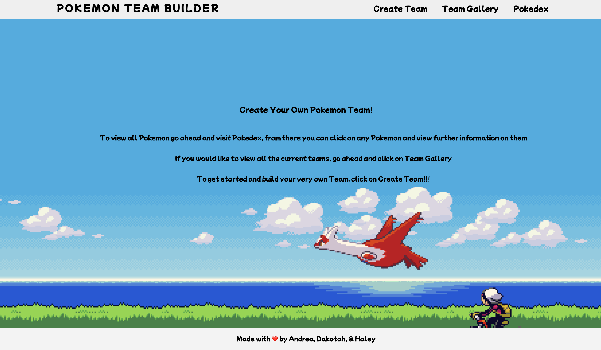
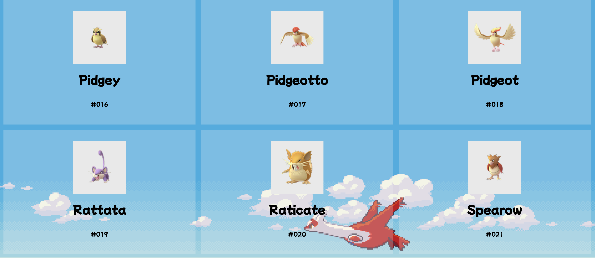
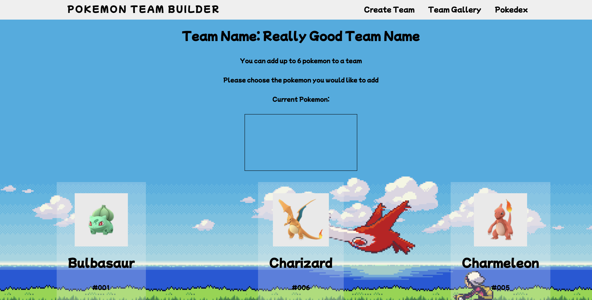

# Pokemon App

## Create Your Own Pokemon Team
In the Pokemon team app users browse the pokedex, browse teams, make a team, and add pokemon to that team.

## Technologies
Example of how to list out your tech

- JavaScript
- React - version 18.2.0
- Node.js - version 18.4.0
- Express.js - version 4.18.1
- Sequelize - version 6.21.3
- mySQL - version 2.18.1

---

## Setup

To run this project:
- Clone this repo
- Fork your cloned repo

First NPM has to be installed in both the root and frontend folder
```
$ cd ../poke-inventory
$ npm install
$ cd ../poke-inventory/frontend
$ npm install
```
A .env file will have to be set up in the root folder, with the following code
```
PORT = 8080
MODE = development
```

To seed the database you will need xampp, phpMyAdmin, and to run the seeder file
```
$ cd ../poke-inventory/backend
$ node seeder.js
```

To run the project use
```
$ cd ../poke-inventory/frontend
$ npm start
$ cd ..
$ npm run dev 
    //you could also use
$ node server.js
```
npm start will start the frontend React project, to get this up and running make sure to be in the frontend folder

npm run dev will start the backend express server, or you can use node server.js to run the server, both while in the root folder

---

## Features

- User can view all Pokemon
- User can add a team
- User can view all teams
- Pokemon can be added to a team

To-do:

- User can delete pokemon off a team
- User can delete teams

---

## How does it look?
Home Page

Pokedex

Make a team

Add Pokemon to a team

_______________________
## Poke_Inventory API

### GET : GET_ALL_TEAMS
returns all teams

http://localhost:8080/api/teams


```json
{
    "allTeams": [
        {
            "id": 1,
            "teamName": "Really Good Team Name",
            "pokemon": "[2]",
            "createdAt": "2022-07-20T20:22:03.000Z",
            "updatedAt": "2022-07-20T20:29:07.000Z"
        },
        {
            "id": 2,
            "teamName": "Really Good Team Name",
            "pokemon": "[]",
            "createdAt": "2022-07-20T20:22:03.000Z",
            "updatedAt": "2022-07-20T20:22:03.000Z"
        }
    ],
    "success": true,
    "message": "All teams returned"
}
```

### GET:  GET_ALL_POKEMON_ON_TEAM

returns all pokemon on a team

http://localhost:8080/api/teams/1/all-pokemon

```json
{
    "findPokemonOnTeam": {
        "pokemon": "[30]"
    },
    "success": true,
    "message": "Pokemon on Team returned"
}
```

### GET: GET_ALL_POKEMON

returns all pokemon

http://localhost:8080/api/getAllPokemon

sample pokemon:
```json
        {
            "id": 1,
            "teamId": null,
            "pokedex": 2,
            "num": "002",
            "name": "Ivysaur",
            "img": "http://www.serebii.net/pokemongo/pokemon/002.png",
            "type": "[\"Grass\",\"Poison\"]",
            "height": "0.99 m",
            "createdAt": "2022-07-21T17:31:27.000Z",
            "updatedAt": "2022-07-21T17:31:27.000Z"
        },
```
### GET: GET_TEAM_BY_ID

http://localhost:8080/api/team/3


Get team by ID

```json
{
    "foundTeam": {
        "id": 1,
        "teamName": "Really Good Team Name",
        "pokemon": "[2]",
        "createdAt": "2022-07-20T20:22:03.000Z",
        "updatedAt": "2022-07-20T20:29:07.000Z"
    },
    "success": true,
    "message": "Team by Id returned"
}
```

### GET: GET_POKEMON_BY_POKEDEX

http://localhost:8080/api/pokemon/2

get pokemon by pokedex

```json
{
    "foundPokemon": [
        {
            "id": 19,
            "teamId": null,
            "pokedex": 20,
            "num": "020",
            "name": "Raticate",
            "img": "http://www.serebii.net/pokemongo/pokemon/020.png",
            "type": "[\"Normal\"]",
            "height": "0.71 m",
            "createdAt": "2022-07-21T17:31:27.000Z",
            "updatedAt": "2022-07-21T17:31:27.000Z"
        }
    ],
    "success": true,
    "message": "Pokemon by pokedex returned"
}
```

### DELETE : DELETE_TEAM

http://localhost:8080/api/delete/team/2

delete a team by id

```json
{
    "deletedTeam": {
        "id": 2,
        "teamName": "Really Good Team Name",
        "pokemon": "[]",
        "createdAt": "2022-07-20T20:22:03.000Z",
        "updatedAt": "2022-07-20T20:22:03.000Z"
    },
    "success": true,
    "message": "Team deleted"
}
```

### POST: CREATE_NEW_TEAM

http://localhost:8080/api/create/team

create team - adds name 

Body:
```json
{
    "teamName" : "TEST TEAM NAME"
}
```

```json
{
    "newTeam": {
        "id": 3,
        "teamName": "TEST TEAM NAME",
        "updatedAt": "2022-07-20T20:37:17.894Z",
        "createdAt": "2022-07-20T20:37:17.894Z"
    },
    "success": true,
    "message": "New team create"
}
```

### PUT: DELETE_POKEMON_OFF_TEAM

http://localhost:8080/api/delete/team/1/pokemon/10

delete pokemon off team

```json
{
    "teamUpdated": {
        "id": 1,
        "teamName": "Really Good Team Name",
        "pokemon": [
            5
        ],
        "createdAt": "2022-07-20T20:22:03.000Z",
        "updatedAt": "2022-07-20T20:38:18.117Z"
    },
    "success": true,
    "message": "Pokemon deleted"
}
```

### PUT: ADD_POKEMON_TO_TEAM

http://localhost:8080/api/add-pokemon/10/team/1

Add pokemon to team

```json
{
    "updatedTeam": {
        "id": 1,
        "teamName": "Really Good Team Name",
        "pokemon": [
            5,
            30
        ],
        "createdAt": "2022-07-20T20:22:03.000Z",
        "updatedAt": "2022-07-20T20:38:37.304Z"
    },
    "success": true,
    "message": "Pokemon Added"
}
```

### PUT: UPDATE_TEAM_NAME

http://localhost:8080/api/update/team-name/1

update team name

body:
```json
{
  "teamName": "TEST NEW TEAM NAME"
}
```

```json
{
    "updatedTeam": {
        "id": 1,
        "teamName": "TEST NEW TEAM NAME",
        "pokemon": "[5,30]",
        "createdAt": "2022-07-20T20:22:03.000Z",
        "updatedAt": "2022-07-20T20:38:54.750Z"
    },
    "sucess": true,
    "message": "Updated team name"
}
```